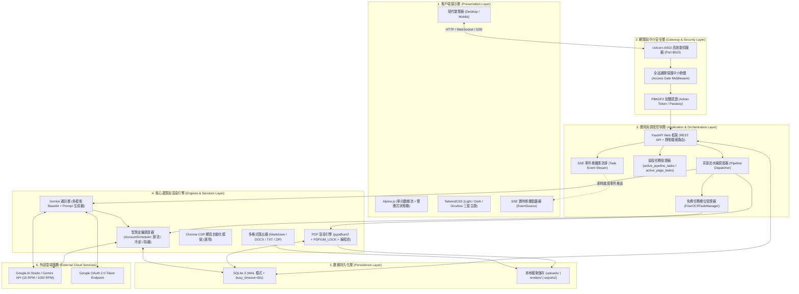
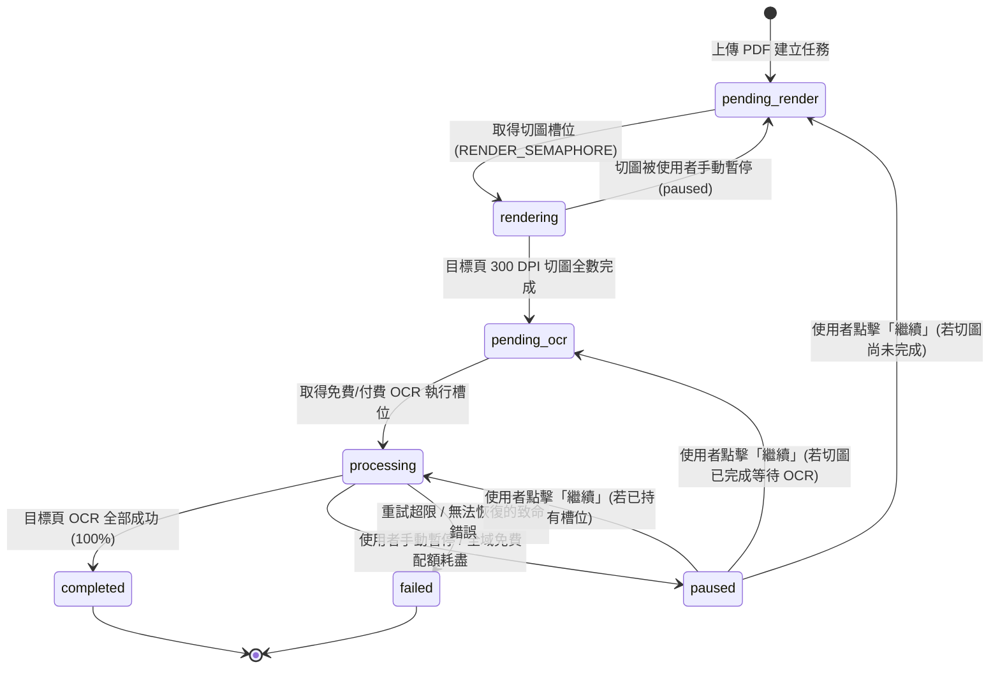
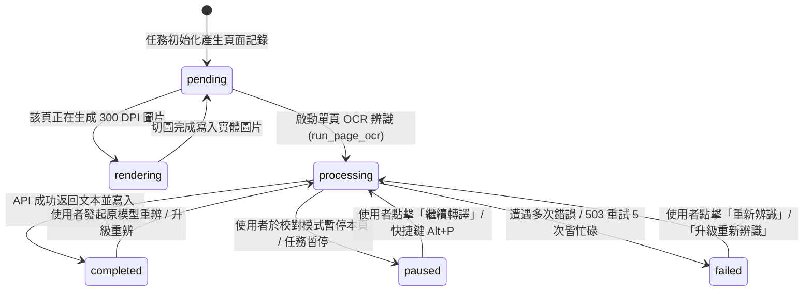
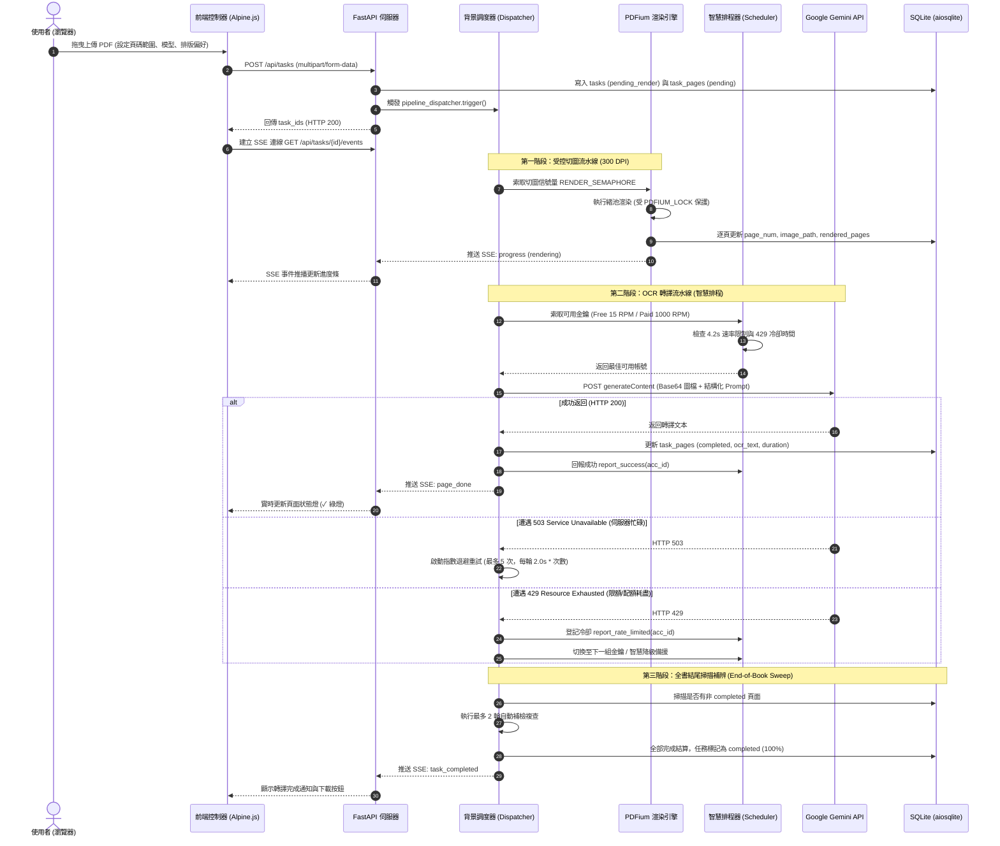
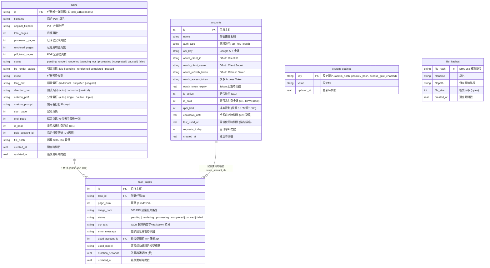
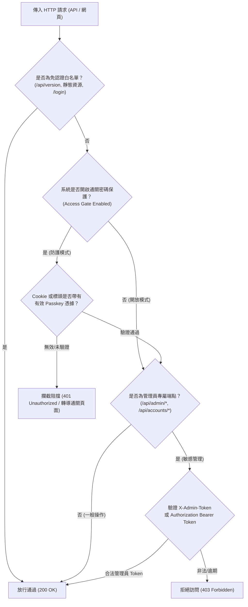

# 🏛️ GASOCR (Google AI Studio Gemini PDF OCR) 系統整體架構文件

<p align="center">
  
  
  
  
  
</p>

---

## 目錄 (Table of Contents)
1. [專案定位與設計哲學](#1-專案定位與設計哲學)
2. [系統總體分層架構 (High-Level Architecture)](#2-系統總體分層架構-high-level-architecture)
3. [核心資料流與狀態機生命週期](#3-核心資料流與狀態機生命週期)
4. [核心模組職責劃分 (Module Breakdown)](#4-核心模組職責劃分-module-breakdown)
5. [關鍵工程架構與防禦機制](#5-關鍵工程架構與防禦機制)
6. [資料庫設計與持久化架構 (Database Schema)](#6-資料庫設計與持久化架構-database-schema)
7. [安全防護與權限控制架構 (Security Architecture)](#7-安全防護與權限控制架構-security-architecture)
8. [即時通訊與前端反應性架構 (Real-Time & Reactive UI)](#8-即時通訊與前端反應性架構-real-time--reactive-ui)
9. [容器化與 CI/CD 部署架構](#9-容器化與-cicd-部署架構)
10. [專案代碼地圖與目錄結構 (Project Tree Map)](#10-專案代碼地圖與目錄結構-project-tree-map)

---

## 1. 專案定位與設計哲學

### 1.1 系統定位
**GASOCR**（Google AI Studio Gemini PDF OCR）是一套專門針對**文獻古籍、學術論文、直排雙欄書籍與多語言現代文檔**打造的高精度、高吞吐量、零成本（\$0 Free Tier）PDF OCR 轉譯 Web 系統。

### 1.2 核心設計哲學
1. **嚴格 \$0 免費額度防護（Zero-Cost & Free-Tier Guardrail）**：
   - 建立嚴密的金鑰隔離體系，免費通道與付費通道完全物理隔離。
   - 嚴格落實 Google AI Studio Free Tier 15 RPM 速率保護（強制 $\ge 4.2$ 秒請求間隔），杜絕超額計費或被服務商封鎖。
2. **多金鑰池輪詢與自動冷卻避讓（Multi-Key Load Balancing & Auto-Cooling）**：
   - 支援無上限掛載 Google API Key / OAuth 2.0 帳號。
   - 智慧排程器進行負載平衡輪詢，遇 `429 Rate Limit` 自動冷卻並無縫切換至下一組金鑰。
3. **無損渲染與高並發控制（Lossless 300 DPI Rendering & Concurrency Throttling）**：
   - 使用底層 `pypdfium2` 進行 300 DPI 印刷級高清逐頁切圖。
   - 引入 C++ 執行緒安全鎖（`PDFIUM_LOCK`）與信號量（`RENDER_SEMAPHORE`），徹底消除記憶體衝突與段錯誤崩潰（SIGSEGV）。
4. **隨時暫停、動態換模型接續（Non-blocking Pause, Resume & Model Hot-Swap）**：
   - 任務可在「切圖階段」或「OCR 階段」隨時安全暫停與接續。
   - 支援暫停中更換任務模型、單頁升級模型重新辨識（Upgrade Re-OCR），不浪費已完成成果。
5. **單一執行檔部署與極致輕量化（Self-contained & Minimal Footprint）**：
   - 後端採用單一輕量非同步 SQLite（WAL 模式），無須額外架設 Redis 或 PostgreSQL。
   - 前端採用純 HTML + Tailwind CSS + Alpine.js，免去複雜 Node.js 建置打包鏈路。

---

## 2. 系統總體分層架構 (High-Level Architecture)

系統整體採用清晰的分層解耦與事件驅動設計（Event-Driven Pipeline Architecture）：



---

## 3. 核心資料流與狀態機生命週期

### 3.1 任務生命週期狀態機 (Task Status Machine)



### 3.2 頁面生命週期狀態機 (Page Status Machine)



### 3.3 端到端轉譯流水線序列圖 (End-to-End Sequence)



---

## 4. 核心模組職責劃分 (Module Breakdown)

| 模組檔案 | 核心類別 / 函數 | 職責與架構角色 |
| :--- | :--- | :--- |
| **`config.py`** | `APP_NAME`, `BUILD_NUMBER`, `RENDERS_DIR` 等 | **全域組態單一真理來源 (SSOT)**<br>管理路徑、速率限制常數、CPU 核心檢測、模型選單、版本號動態同步。 |
| **`main.py`** | `process_task_pipeline`, `run_page_ocr`, `pause_single_page`, `lifespan` | **系統樞紐與 ASGI 核心**<br>包含 FastAPI 應用實例、生命週期管理、背景協程調度器、SSE 即時匯流排、所有 REST API 端點。 |
| **`scheduler.py`** | `AccountScheduler`, `FreeOCRTaskManager`, `calculate_free_quota_reset_info` | **智慧帳號與並發排程器**<br>負責免費金鑰 15 RPM 節流、付費金鑰 1000 RPM 高速通道隔離、429 連續額度耗盡熔斷判定、美西午夜配額重置精確換算。 |
| **`pdf_engine.py`** | `render_pdf_to_images_async`, `render_single_page`, `PDFIUM_LOCK` | **高品質 PDF 渲染引擎**<br>透過 `pypdfium2` 實現 300 DPI 高清切圖、多核心線程池並行計算、**全域執行緒鎖徹底修復段錯誤 (SIGSEGV)**。 |
| **`gemini_ocr.py`** | `call_gemini_ocr`, `sanitize_model_name`, `build_ocr_prompt` | **Gemini 模型多模態介面**<br>結構化 OCR Prompt 動態生成（直排、雙欄、繁簡轉換）、模型名稱清洗（去除裝飾標籤防 400 錯誤）、OAuth 2.0 自動刷新憑證。 |
| **`database.py`** | `init_db`, `get_db`, `update_page_result`, `pause_task_in_progress_pages` | **非同步資料庫持久化層**<br>基於 `aiosqlite` 封裝，開啟 WAL 模式與 busy timeout 防鎖死；負責任務、頁面、金鑰與系統安全設定的原子寫入。 |
| **`rate_limiter.py`** | `TokenBucketRateLimiter` | **記憶體內速率保護器**<br>漏桶/權杖桶演算法實作，針對 Free Tier 與 Paid Tier 實施不同時間尺度的防抖動節流。 |
| **`exporters.py`** | `export_markdown`, `export_docx`, `export_txt`, `export_zip` | **多格式成品打包匯出引擎**<br>生成結構化 Markdown、純文字、Microsoft Word 文件，以及打包含 300 DPI 高清切圖的 ZIP 壓縮包。 |
| **`web_rpa.py`** | `run_web_ocr`, `connect_over_cdp` | **瀏覽器自動化 RPA 備援模組**<br>支援透過 Chrome DevTools Protocol (CDP) 接入本機已登入 Chrome 視窗，提供網頁端直接調用能力。 |
| **`templates/`** | `index.html`, `scripts.html`, `viewer_modal.html` 等 | **響應式前端 UI 元件系統**<br>以 Alpine.js 為狀態驅動，內建重辨佇列抽屜、左圖右文校對器、多帳號管理面板與全域鍵盤快速鍵。 |

---

## 5. 關鍵工程架構與防禦機制

### 5.1 雙軌金鑰調度與嚴格隔離架構 (Dual-Track Strict Isolation)
為落實「免費任務絕對不花一分錢，付費通道享有千倍極速」的設計承諾：
- **免費通道（Free Tier）**：
  - 強制加上每組金鑰請求間隔 $\ge 4.2\text{s}$（嚴格卡在 $15\text{ RPM} = 60/15 = 4.0\text{s}$ 安全線內）。
  - 受 `FreeOCRTaskManager` 管控：免費金鑰 $\le 2$ 組時，全局僅允許同時執行 1 個任務；$\ge 3$ 組時開放 2 個任務並發，杜絕跨任務並發打爆免費配額。
  - **免費輪詢模式下，嚴格過濾 `is_paid == 0`，絕不可能呼叫或扣除付費金鑰的額度。**
- **付費通道（Paid Tier - 💎）**：
  - 支援高達 $1000\text{ RPM}$（僅保留 $0.2\text{s}$ 防抖延遲）。
  - 支援「輪詢付費池」或「鎖定專屬付費金鑰 ID」。
  - 完全不受 `FreeOCRTaskManager` 免費槽位排隊限制，隨到隨審。

### 5.2 PDFium 執行緒安全與全域鎖機制 (`PDFIUM_LOCK`)
在早期開發中，多執行緒同時渲染 PDF 容易導致 Python 直譯器因底層 C++ 記憶體訪問衝突而拋出 `SIGSEGV`（段錯誤崩潰）。
- **架構方案**：在 `pdf_engine.py` 中引入 `PDFIUM_LOCK = threading.RLock()`。
- **邊界控制**：只在開啟 PDF、讀取頁數、調用 `page.render()` 等 C++ 邊界上鎖；將耗費 CPU 的 PIL 編碼與磁碟寫入（`_save`）留在鎖外，既確保了 $100\%$ 的直譯器零崩潰穩定度，又最大化保留了多核 I/O 吞吐效能。

### 5.3 503 伺服器忙碌與 429 智慧降級備援
- **503 自動退避**：當 Google 伺服器因超載返回 `503 Service Unavailable` 或 `MODEL_OVERLOADED` 時，系統自動實施 **5 次連續重試**，每次重試間隔為 $2.0\text{s} \times \text{重試次數}$（$2\text{s} \to 4\text{s} \to 6\text{s} \to 8\text{s} \to 10\text{s}$）。
- **429 智慧降級（Smart Fallback）**：若付費金鑰耗盡或旗艦高階模型（如 `gemini-2.5-pro`）頻繁觸發限額，系統自動降級為預設穩定模型（`gemini-3.5-flash-lite`）續跑，頁面標記為 `[降級備援]`，確保長任務不中斷。
- **全域免費配額耗盡保護**：當所有免費金鑰皆連續 3 次回傳額度上限時，系統自動將任務轉為 `paused`，並計算精確的**美西午夜（00:00 AM PT）重置倒數時間**提示使用者。

### 5.4 全書結尾掃描補辨機制 (End-of-Book Sweep)
針對大冊古籍（例如幾百頁的 PDF），因網路抖動或偶發 429 導致零星頁面失敗。系統在批次轉譯最後一頁完成後，自動啟動 **End-of-Book Sweep（最多 2 輪補檢複查）**：
- 自動掃描目標範圍內所有非 `completed` 或文本為空的頁面。
- 短暫冷卻 2.5 秒後進行補辨，將全書成功率推進至 $100\%$。

### 5.5 單頁即時補渲染防禦 (On-Demand Re-slice Defense)
當使用者在任務剛上傳或仍在佇列中時，於校對模式點擊「重新辨識本頁」或「繼續轉譯」：
- 若實體 PNG 尚未被排程切出，`run_page_ocr` 會自動觸發 `render_single_page` 進行單頁即時渲染，防止丟出 `FileNotFoundError` 導致失敗。

---

## 6. 資料庫設計與持久化架構 (Database Schema)

系統採用 SQLite 3，配合 `aiosqlite` 實現全非同步操作。啟動時自動套用 `PRAGMA journal_mode = WAL;` 與 `PRAGMA busy_timeout = 30000;`，實現極高並發讀寫且無鎖死（Database Locked）。



---

## 7. 安全防護與權限控制架構 (Security Architecture)

系統內建開箱即用的「雙層權限閘門（Access Gate）」：



### 7.1 安全特性
- **PBKDF2 加鹽雜湊**：所有密碼（管理員密碼、訪客通關密碼）皆以 `hashlib.pbkdf2_hmac` 配合隨機鹽值與 $100,000$ 次反覆運算加密儲存。
- **金鑰脫敏機制（Data Masking）**：API 回傳與前端渲染帳號清單時，API Key 自動脫敏為遮罩格式（例如 `AIza....5678`），杜絕操作截圖或畫面錄製洩露憑證。
- **磁碟配額守門員**：透過 `_free_disk_bytes()` 即時監控資料夾剩餘容量，剩餘磁碟低於安全閥值（預設 2GB）時自動拒絕上傳並暫停切圖，避免硬碟寫爆導致作業系統毀損。

---

## 8. 即時通訊與前端反應性架構 (Real-Time & Reactive UI)

前端摒棄繁重的外部龐大框架，採用輕量現代化技術棧：
- **Alpine.js 2.x/3.x**：單向響應式數據流與宣告式 DOM 綁定。
- **Tailwind CSS**：無依賴實時渲染，內建淺色（Light）、深色（Dark）與 Gruvbox 復古專業主題。
- **Lucide Icons**：SVG 矢量圖標。

### 8.1 Server-Sent Events (SSE) 即時通訊
- **端點**：`GET /api/tasks/{task_id}/events`
- **機制**：長連線單向伺服器推播。相較於 WebSocket，SSE 具有原生斷線自動重連（Auto-reconnect）、穿透反向代理（Nginx/Cloudflare）容易、資源開銷極低之優勢。
- **事件流類型**：
  - `task_status`：任務整體狀態流轉。
  - `progress`：渲染與 OCR 百分比進度更新。
  - `page_done`：單頁完成事件（回傳頁碼、耗時、模型、文本摘錄）。
  - `page_paused` / `page_failed`：單頁暫停或出錯即時通知。

### 8.2 實體鍵位適配（macOS / Windows 鍵盤無縫對應）
在校對檢視器中，為了解決 macOS 上 `Option (⌥)` 鍵作為死鍵組合會改寫 `event.key` 的硬體層級衝突：
- 前端監聽一律以 **`event.code`（實體物理鍵位置）** 判定（例如 `code === 'KeyP'`），確保 macOS 與 Windows/Linux 體驗 $100\%$ 一致。

### 8.3 重辨與升級佇列之 Prompt 動態重編架構 (Queue Prompt Re-editing)
- **單項目專屬 Prompt 編輯**：每個佇列工作卡片支援獨立展開 Prompt 編輯抽屜，可針對個別頁面輸入專用提示詞（如古籍雙行夾註、缺字標記、生僻字對照表）。
- **儲存並立即重辨 (Save & Rerun)**：點擊「儲存並重辨」時直接攜帶新 Prompt 請求 `POST /api/tasks/{id}/pages/{page}/resume`，立即重啟非同步 OCR。
- **任務級 Prompt 同步更新**：支援勾選「同步更新所屬任務 Prompt」，並在佇列頂部提供當前任務 Prompt 快速編輯器，調用 `PATCH /api/tasks/{id}/prompt` 即時持久化至資料庫。

---

## 9. 容器化與 CI/CD 部署架構

### 9.1 Dockerfile 設計
- **基礎映像**：`python:3.11-slim`（Debian Bookworm）。
- **中文字型優化**：安裝 `fonts-wqy-microhei`（文泉驛微米黑，約 15MB），取代肥大的 `fonts-noto-cjk`（約 380MB），兼顧古籍渲染清晰度與容器極致輕量化。
- **持久化分卷**：聲明 `VOLUME ["/app/data"]`，包含資料庫、切圖暫存、上傳與匯出成品。

### 9.2 GitHub Actions CI/CD 流水線
- **觸發條件**：推播或 PR 至 `main` 分支。
- **自動化任務**：
  1. 執行單元與端點整合測試（`test_api.py`）。
  2. 建置多架構 Docker 映象檔並推送至 GitHub Container Registry (`ghcr.io/jmedzen/gasocr:latest`)。
  3. **自動清理工作流程**：透過 GitHub API 自動維護映象檔版本，**自動保留最新的 5 個版本**，定期修剪歷史陳舊映象檔，節省儲存空間。

---

## 10. 專案代碼地圖與目錄結構 (Project Tree Map)

```text
/Users/jm/SyncDev/A1-antigravity/googleOCR
├── ARCHITECTURE.md                  # 🏛️ 本架構設計說明書
├── README.md                        # 📖 使用者指南與功能手冊
├── Dockerfile                       # 🐳 生產環境容器建置檔
├── compose.yaml / docker-compose.yml# 🚀 Docker 服務編排組態
├── requirements.txt                 # 📦 Python 相依套件清單
├── version.json                     # 🏷️ 版本號 SSOT 檔案 (Build 054)
│
├── config.py                        # ⚙️ 系統常數、路徑、模型清單組態
├── main.py                          # 🌐 FastAPI ASGI 核心、流水線協程、REST API
├── scheduler.py                     # ⏱️ 智慧多帳號調度器、速率節流、配額追蹤
├── pdf_engine.py                    # 📄 PDFium 300 DPI 切圖引擎 (含 PDFIUM_LOCK)
├── gemini_ocr.py                    # 🤖 Google Gemini API 多模態通訊與 Prompt 產生器
├── database.py                      # 💾 非同步 SQLite 資料庫訪問層 (aiosqlite)
├── rate_limiter.py                  # 🪣 漏桶/權杖桶速率限制器
├── exporters.py                     # 📤 Markdown / TXT / DOCX / ZIP 多格式匯出
├── web_rpa.py                       # 🌐 Chrome CDP 網頁自動化備援模組
│
├── data/                            # 📁 持久化資料夾 (掛載 Volume)
│   ├── ocr.db                       # 🗄️ SQLite 資料庫檔案 (WAL 模式)
│   ├── uploads/                     # 📥 上傳的原始 PDF 檔案
│   ├── renders/                     # 🖼️ 逐頁 300 DPI PNG 高清切圖暫存
│   └── exports/                     # 📦 已產生的匯出成品檔案
│
├── templates/                       # 🎨 前端 HTML 視圖與組件模組
│   ├── index.html                   # 🏠 主頁面佈局與骨架
│   └── components/
│       ├── head_styles.html         # 🖌️ 主題樣式 (Light / Dark / Gruvbox)
│       ├── task_upload.html         # 📤 批次上傳、模型與排版設定卡片
│       ├── task_list.html           # 📋 批次任務進度列表與狀態切換
│       ├── live_dashboard.html      # ⚡ 活躍任務即時狀態儀表板
│       ├── viewer_modal.html        # 🔍 左圖右文校對檢視器與單頁重辨
│       ├── queue_modal.html         # 📑 重辨佇列管理抽屜
│       ├── accounts_modal.html      # 🔑 多帳號金鑰管理池
│       ├── admin_modal.html         # 🛡️ 管理員設定與全站安全通關閘門
│       ├── tools_modal.html         # 🧰 任務工具箱 (手動通過 / 重新切圖)
│       └── scripts.html             # 🧠 Alpine.js 核心控制器與 SSE 監聽邏輯
│
├── static/                          # 靜態資源 (圖標、自訂樣式)
├── .github/workflows/               # 🤖 GitHub Actions CI/CD 自動化工作流程
└── test_*.py                        # 🧪 單元與整合自動化測試套件 (涵蓋 100% 核心鏈路)
```
